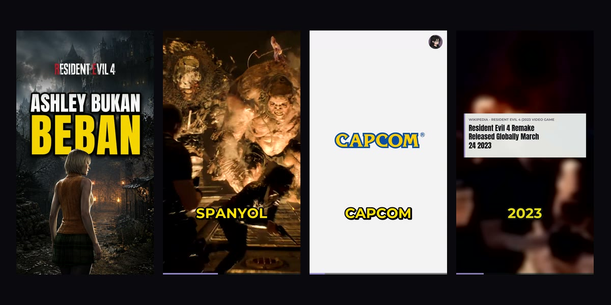
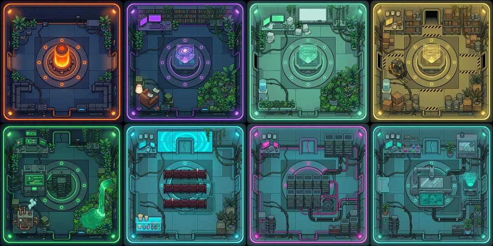
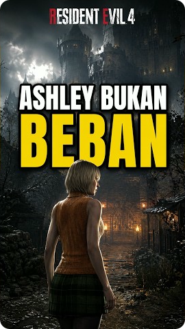

Solo builder from Bali. I hand boring, repeatable work to agents, and every pipeline I ship has a checker that measures its own output, so a model can't just say it's done. 
[Portfolio](https://aryamulya-portfolio.vercel.app) · [YouTube @lorenesia](https://www.youtube.com/@lorenesia)

### Featured

<table>
<tr>
<td width="50%" valign="top">

**[Lorenesia](https://aryamulya-portfolio.vercel.app/work/lorenesia)** 
An agent pipeline that makes Indonesian YouTube Shorts about hidden game stories. It picks the topic, writes the script, cuts the footage, burns the subtitles, and a checker fails its own bad renders. I record the voice and press upload.

Node · ffmpeg · Gemini · Groq Whisper · Discord 
[Case study](https://aryamulya-portfolio.vercel.app/work/lorenesia) · [Channel](https://www.youtube.com/@lorenesia)
</td>
<td width="50%" valign="top">

**[Kantor Kurator](https://agents-dashboard-rho.vercel.app)** 
The live dashboard for Lorenesia. A station of eight painted rooms, and the agents walk between them as jobs move. State syncs from my laptop through Supabase every ten seconds, behind an owner-only login.

Canvas · Supabase · Vercel 
[Dashboard](https://agents-dashboard-rho.vercel.app) · [Source](https://github.com/kaizen-002/agents-dashboard)
</td>
</tr>
</table>

### Latest on Lorenesia

<!-- SHORTS:START -->
<table><tr>
<td align="center" valign="top" width="180">
 
MERAJAI STEAM GLOBAL
</td>
<td align="center" valign="top" width="180">
 
ASHLEY BUKAN BEBAN
</td>
</tr></table>
<!-- SHORTS:END -->

Refreshed every morning from the channel's RSS feed by a GitHub Action in this repo.

### Tools I reach for

 

<picture>
  <source media="(prefers-color-scheme: dark)" srcset="https://raw.githubusercontent.com/kaizen-002/kaizen-002/output/snake-dark.svg">
  
</picture>
